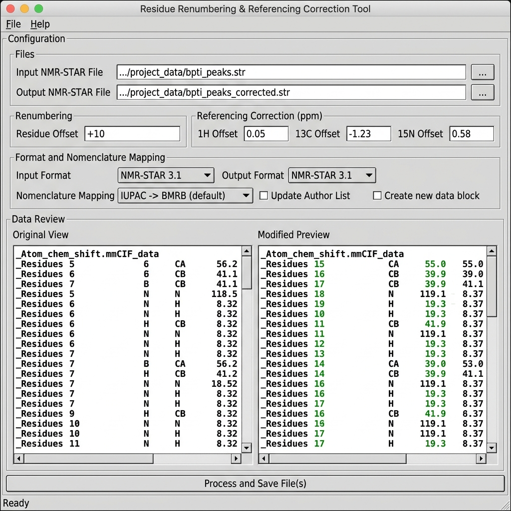

# NMR Data Editor

A lightweight Python tool featuring a simple, native system GUI and a headless CLI for batch renumbering residue indices, translating nomenclatures, and applying referencing corrections (offsets) to protein structures, nucleic acids (DNA/RNA), and NMR chemical shift files.

The tool preserves exact file alignment, trailing comments, and column spacing across all operations.

---

## Program Use Case Screenshots

### 1. Main User Interface (Original vs Modified Preview)


### 2. Pop-up Validation Report Window
The validation results are displayed in a clean, scrollable pop-up window showing any biological out-of-bounds alerts.

---

## Features

- **Native GUI Theme**: Basic, lightweight, and clean system-native theme (no heavy styling or external CSS dependencies) with side-by-side original/modified preview screens.
- **CLI Mode (Headless)**: Fully featured command-line interface supporting headless automation and scripting pipelines.
- **Batch Processing**: Select and process multiple files simultaneously, with a dedicated file-selector dropdown in the GUI to preview any file in the queue.
- **Nomenclature Translation**:
  - **Proteins**: Automated mapping between IUPAC and CYANA/DYANA atom naming standards (supporting alpha, beta, and branch-chain protons across standard amino acids).
  - **Nucleic Acids**: Supports DNA and RNA sugar proton mapping (e.g., IUPAC `H2''` $\leftrightarrow$ CYANA `H2'2`, `H5'` $\leftrightarrow$ `H5'1`, `H5''` $\leftrightarrow$ `H5'2`, DNA-specific `H2'` $\leftrightarrow$ `H2'1`).
- **Referencing Corrections**: Apply individual chemical shift offsets in ppm for Proton ($^1$H), Carbon ($^{13}$C), and Nitrogen ($^{15}$N).
- **Out-of-Bounds Validation**: Automatic biological feasibility validation against standard biological bounds:
  - **Proteins**: $^1$H [0.0 - 12.0 ppm], $^{13}$C [10.0 - 220.0 ppm], $^{15}$N [90.0 - 140.0 ppm].
  - **Nucleic Acids**: Automatically detected to expand boundaries to accommodate base protons ($^1$H up to 15.0 ppm for imino protons) and base nitrogens ($^{15}$N up to 260.0 ppm) to prevent false alerts.
- **Alignment-Preserving Spacer**: Dynamically adjusts whitespace padding downstream when token lengths change (e.g. `9` -> `109`) to keep table columns perfectly aligned.
- **Zero External Dependencies**: Built entirely using Python's standard library (`tkinter`, `argparse`, and `re`).

---

## File Format Support

1. **NEF (`.nef`)**:
   - Updates `sequence_code` across sequence, chemical shift, and distance restraint lists.
   - Applies chemical shift offsets using `_nef_chemical_shift.element` (with fallback to `_nef_chemical_shift.atom_name` prefixes if elements are unspecified).
2. **NMR-STAR (`.txt`, `.str`, `.star`)**:
   - Updates `_Atom_chem_shift.Comp_index_ID`.
   - Modifies chemical shift values (`_Atom_chem_shift.Val`) and identifies target nuclei from `_Atom_chem_shift.Atom_ID`.
3. **PDB (`.pdb`)**:
   - Renumbers residue sequence numbers in `ATOM`, `HETATM`, `ANISOU`, and `TER` records.
   - Translates atom names according to the selected nomenclature standard.
4. **TALOS (`.tab`, `.talos`)**:
   - Parses VARS columns to renumber `RESID` indices and correct chemical shifts for specified nuclei.
5. **Sparky (`.list`, `.sparky`, `.peaks`)**:
   - Parses multi-dimensional assignment labels (e.g. `G759H-G759N` -> `G859H-G859N`), renumbers them, maps atom nomenclatures, and offsets corresponding shift columns (`w1`, `w2`, `w3`).
6. **Yasara (`.tbl`)**:
   - Fallback regex mode to renumber `resid <num>` and `<num> <amino_acid>` definitions while preserving file spacing.

---

## Getting Started

### Prerequisites
- Python 3.6 or later.

### Running the GUI App
On Windows, you can double-click the `Residue Renumberer.lnk` shortcut to launch the app directly in the background using `pythonw.exe` (with the standard Python logo icon).

Alternatively, launch from your terminal:
```bash
python renumber_residues.py
```

### Running in Headless CLI Mode
Provide arguments directly to the script to run it without launching the GUI:
```bash
python renumber_residues.py -i input1.nef input2.pdb -o ./output_dir -r 100 --proton 0.010 -n IUPAC_TO_CYANA
```

**CLI Options:**
- `-i`, `--input`: One or more input file paths (separated by spaces).
- `-o`, `--output`: One or more output file paths or a single output directory.
- `-r`, `--residue`: Residue index offset integer (e.g., `100` or `-50`).
- `--proton`, `--carbon`, `--nitrogen`: Chemical shift offset values in ppm.
- `--no-detect`: Disable automatic format detection and rely strictly on file extensions.
- `-n`, `--nomenclature`: Nomenclature mapping standard (`NONE`, `IUPAC_TO_CYANA`, or `CYANA_TO_IUPAC`).

---

## Project Structure

- `renumber_residues.py`: Main GUI and CLI script.
- `Residue Renumberer.lnk`: Direct Windows shortcut configured to run via `pythonw.exe`.
- `assets/`: Program screenshots and user interface figures.
- `README.md`: Project documentation.
